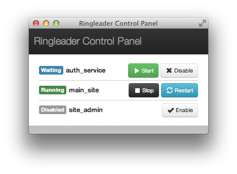

```plain
       _____
      (, /   ) ,          /)          /)
        /__ /   __   _   //  _  _   _(/  _  __
     ) /   \__(_/ (_(_/_(/__(/_(_(_(_(__(/_/ (_
    (_/            .-/
                  (_/
```

Ringleader is an application proxy for socket applications.

## Is it any good?

[Yes](http://news.ycombinator.com/item?id=3067434).

## What's it for?

I designed this for a large suite of apps running behind nginx with a somewhat
complex routing configuration. Additionally, many of the apps required active
[resque](https://github.com/defunkt/resque/) pollers to run properly. Ultimately
this meant having many terminal windows open just to make a few requests to the
apps. Instead, I wanted something to manage all that for me.

Before, each app in a terminal, started manually:

                                    +-------+
                                 +->| app 1 |
                                 |  +-------+
                  +-----------+  |
      http        |           |  |  +-------+
    requests ---> |   nginx   +--+->| app 2 |
                  |           |  |  +-------+
                  +-----------+  |
                                 |  +-------+
                                 +->| app n |
                                    +-------+

After, apps managed by ringleader, started on demand:

                                                        +-------+
                                                     +->| app 1 |
                                                     |  +-------+
                  +-----------+    +--------------+  |
      http        |           |    |              |  |  +-------+
    requests ---> |   nginx   +--->|  ringleader  +--+->| app 2 |
                  |           |    |              |  |  +-------+
                  +-----------+    +--------------+  |
                                                     |  +-------+
                                                     +->| app n |
                                                        +-------+

Ringleader gives on-demand startup and proxying for any TCP server program. It
can be a rails app managed with foreman, a node app, or simply a shell command
to start netcat.

## Isn't this just like inetd?

Pretty much. But with pretty colors in console and a nice web interface.

## Web interface?

Yep. Hook it up with [fluid](http://fluidapp.com) and put it in the menu bar. By
default it runs at [http://localhost:42000](http://localhost:42000).




## Installation

    $ gem install ringleader
    $ ringleader --help

## Configuration

Ringleader requires a yml configuration file to start. It should look something
like this:

```yml
---
# name of app (used in logging)
main_app:

  # Required settings
  dir: "~/apps/main"       # Working directory
  command: "foreman start" # The command to run to start up the app server.
                           # Executed under "bash -c".
  server_port: 3000        # The port ringleader listens on
  app_port: 4000           # The port the application listens on

  # Optional settings
  host: 127.0.0.1          # The host ringleader should listen on
  idle_timeout: 6000       # Idle timeout in seconds
  startup_timeout: 180     # Application startup timeout
  disabled: true           # Set the app to be disabled when ringleader starts
  env:                     # Override or set environment variables inherited
    FOO: hello             # from the current environment. Use nil to unset a
    BAR: nil               # var.
  kill_with: TERM          # Signal to use to kill the process tree with. Use
                           # KILL if the default (TERM) is leaving zombies.

  # If you have an application managed by rvm, this setting automatically adds
  # the rvm-specific shell setup before executing the given command. This
  # supersedes the `command` setting.
  rvm: "foreman start"

  # Likewise for rbenv:
  rbenv: "foreman start"

other_app:
  [...]
```

## License

MIT, see `LICENSE`.

Top hat icon by [Luka Taylor](http://lukataylo.deviantart.com/gallery/#/d2g95fp)
under a Creative Commons Attribution/Non-commercial license.

## Contributing

1. Fork it
2. Create your feature branch (`git checkout -b my-new-feature`)
3. Commit your changes (`git commit -am 'Add some feature'`)
4. Push to the branch (`git push origin my-new-feature`)
5. Create new Pull Request
